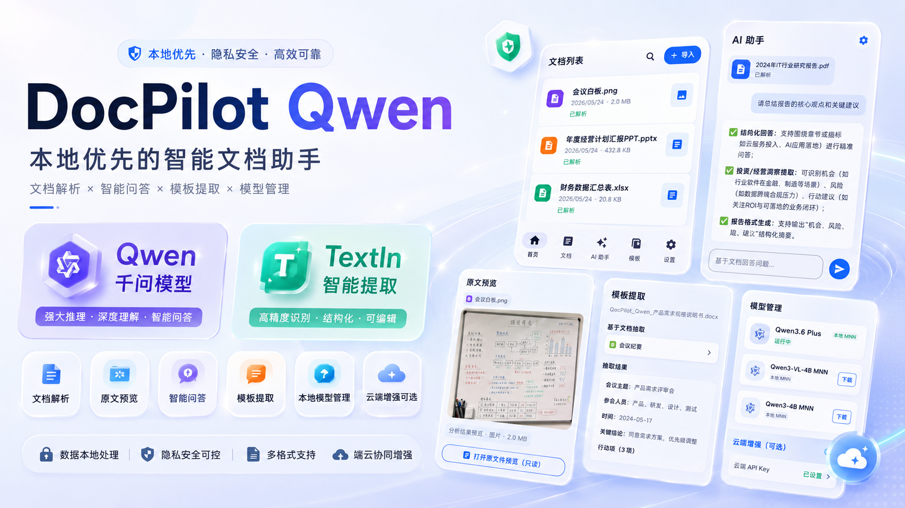
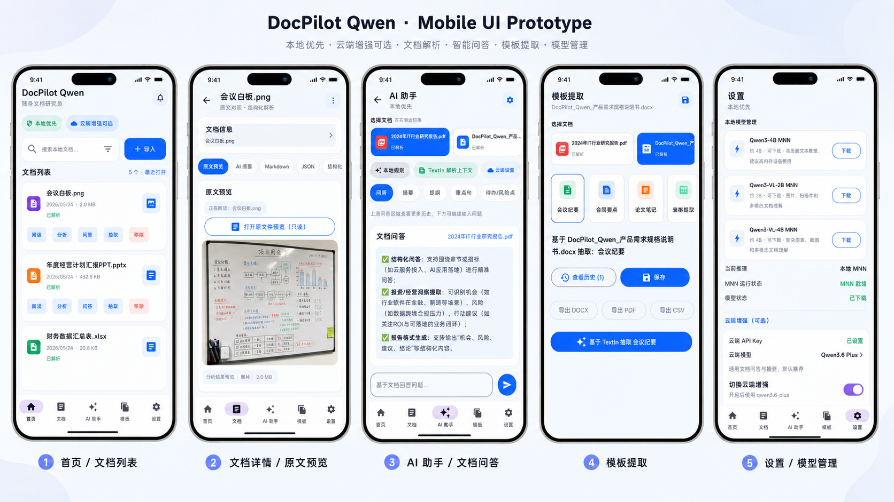

# DocPilot Qwen



```md
本项目使用 KAT-Coder-Pro V2 搭建 
```

## 下载 APK

Android 用户可以直接下载当前 Debug 安装包：

[下载 DocPilotQwen-1.0.0-debug.apk](./releases/DocPilotQwen-1.0.0-debug/DocPilotQwen-1.0.0-debug.apk)


DocPilot Qwen 是一个面向 Android 手机的开源文档 AI 助手。它把文档导入、TextIn 解析、Qwen 问答、摘要生成、模板抽取和本地记录整理到一个原生 App 里，让手机也能完成日常学习、论文阅读、报告整理和办公文档分析。

## 背景

移动端已经有足够强的算力，但很多文档 AI 工具仍然依赖云端、桌面端或封闭产品。DocPilot Qwen 想做的是一个更适合学生和开发者拆解、学习、复用的 Android 示例：能跑、能改、能接 API，也能继续往端侧模型方向深入。

项目选用 Qwen 系列模型作为核心推理能力，支持云端 API 协同；同时接入 MNN 框架，并预留针对 Arm SME2 指令集进行端侧推理加速与性能调优的路径，让手机算力真正释放。文档解析侧加入 TextIn Skill / xParse 能力，适合处理 PDF、Office、图片等复杂文档；TextIn 当前开发者额度较友好，最高可覆盖每天约 4000 页解析需求，具体以官方政策为准。

本项目完全开源，代码结构尽量保持清晰。它既可以作为个人文档助手继续打磨，也很适合在校大学生拿来做 Android 课程作业、毕业设计原型、AI 应用实践项目，或者作为 Kotlin + Compose + Room + Retrofit 的综合练手项目。

## UI原型



## 功能概览

- 文档导入：支持 PDF、图片、DOCX、PPTX、XLSX。
- 文档解析：通过 TextIn xParse 生成 Markdown、结构化 JSON 和页级来源线索。
- AI 助手：支持基于当前文档进行问答、摘要、提纲、重点句和待办/风险点生成。
- 云端协同：支持 Qwen 兼容 OpenAI Chat Completions 接口，包含普通请求和流式问答。
- 本地优先：无 API Key 或远端失败时，使用本地规则兜底，保证演示链路不中断。
- 端侧推理准备：APK 已包含 MNN arm64 运行库，本地模型管理入口已接入。
- 本地存储：Room 保存文档、聊天记录、抽取结果；Android Keystore 保存 API 凭证。
- 演示资产：首次启动内置 5 个示例文档，方便直接展示 App 能力。

## 技术栈

- 语言与 UI：Kotlin、Jetpack Compose、Material 3
- 架构组件：AndroidX Lifecycle、Navigation Compose、ViewModel、Coroutines、StateFlow
- 本地数据：Room、DataStore Preferences、Android Keystore
- 网络请求：Retrofit、OkHttp、Gson
- 文档解析：TextIn xParse API
- AI 模型：Qwen 系列云端 API，兼容 OpenAI Chat Completions 格式
- 端侧推理：MNN、arm64-v8a native libraries、Arm SME2 优化方向
- 构建工具：Gradle、Android Gradle Plugin、JDK 17、Android SDK 35

## 使用方法

### 1. 获取 API Key

- Qwen / 阿里云百炼 API Key：[DashScope API Key 获取指南](https://help.aliyun.com/zh/model-studio/get-api-key)
- TextIn API Key：[TextIn Skill API 获取入口](https://cc.co/16YSfR)

### 2. 克隆项目

```powershell
git clone <your-repo-url>
cd DocPilotQwen
```

### 3. 配置 Android SDK

在项目根目录创建或检查 `local.properties`：

```properties
sdk.dir=C\:\\Users\\你的用户名\\AppData\\Local\\Android\\Sdk
QWEN_BASE_URL=https://dashscope.aliyuncs.com/compatible-mode/v1/
TEXTIN_BASE_URL=https://api.textin.com/
```

真实的 Qwen API Key、TextIn app-id 和 TextIn secret 不要写进源码。打开 App 后，在“设置”页面录入，应用会通过 Android Keystore 保存。

### 4. 构建 Debug APK

```powershell
.\gradlew.bat :app:assembleDebug
```

构建产物位于：

```text
app/build/outputs/apk/debug/app-debug.apk
```

### 5. 安装到手机

手机打开 USB 调试并连接电脑后执行：

```powershell
.\gradlew.bat :app:installDebug
```

也可以手动启动：

```powershell
& "$env:LOCALAPPDATA\Android\Sdk\platform-tools\adb.exe" shell am start -n com.docpilot.qwen/.MainActivity
```

### 6. App 内使用流程

1. 打开 App，首页会自动初始化示例文档。
2. 点击“导入”选择自己的 PDF、图片或 Office 文档。
3. 在“设置”中填入 TextIn 与 Qwen 凭证，开启更完整的解析和云端问答。
4. 进入“文档”查看解析后的 Markdown、JSON、表格和来源。
5. 进入“AI 助手”进行文档问答、摘要、提纲、重点句和风险点生成。
6. 进入“模板”按合同要点、会议纪要、论文笔记等模板抽取内容。

## APK 包含内容

当前 Debug APK 包含：

- Android 原生应用代码：`com.docpilot.qwen`
- Compose UI、Room 数据库、DataStore 设置、Keystore 凭证管理
- TextIn xParse 与 Qwen API 网络模块
- 5 个首次启动演示文档：
  - `2024_it_industry_report.pdf`
  - `annual_plan.pptx`
  - `docpilot_qwen_prd.docx`
  - `finance_summary.xlsx`
  - `meeting_whiteboard.png`
- MNN arm64-v8a 动态库：
  - `libMNN.so`
  - `libmnnllmapp.so`
  - `libdocpilot_mnn_llm.so`
  - `libc++_shared.so`

## 最新更新包

本地整理好的最新 Debug 更新包位于：

```text
releases/DocPilotQwen-1.0.0-debug/
```

其中包含：

- `DocPilotQwen-1.0.0-debug.apk`
- `APK_CONTENTS.md`

源码、文档、演示资产和 Debug APK 更新包已整理到仓库，适合用于课程作业展示、移动端 AI 文档助手演示和二次开发学习。

## 开源协议

本项目采用 MIT License 开源，详见 [LICENSE](LICENSE)。
